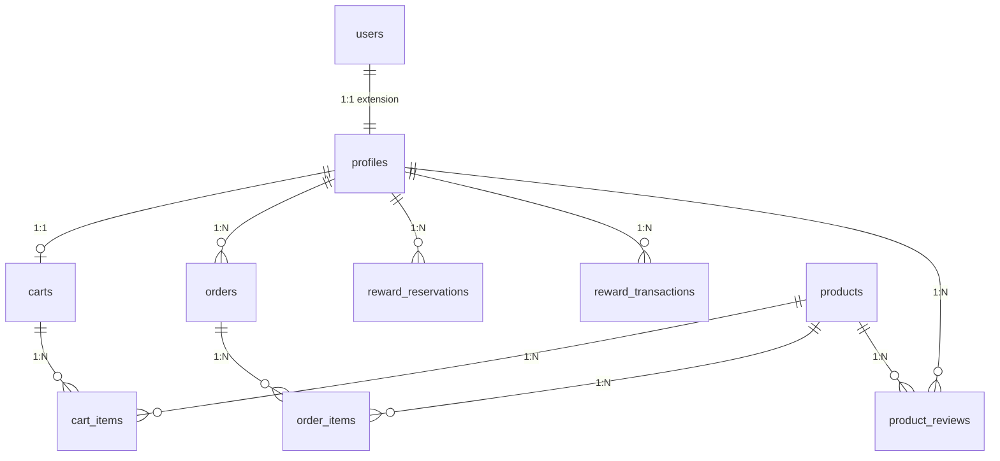
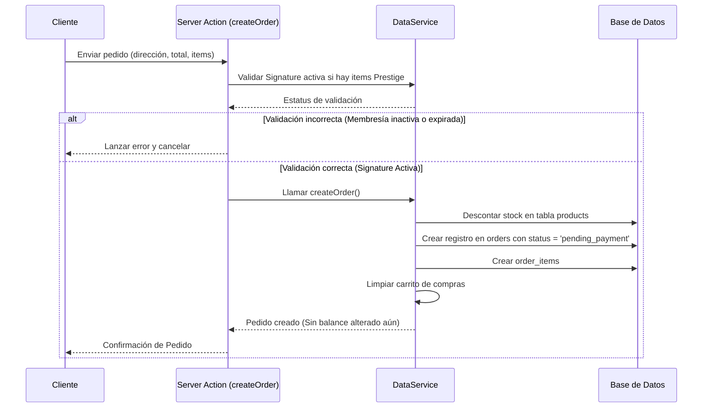

# Guía Técnica Completa del Sistema: Club de Marcas

Esta guía detalla la arquitectura, el modelo de datos, los componentes clave y los flujos operativos de **Club de Marcas**, una plataforma web de e-commerce premium tipo outlet que integra un programa de recompensas de lealtad ("Saldo Club") y un programa promocional de permanencia para acumular bonificaciones adicionales.

---

## 1. Arquitectura General y Tecnologías

El sistema está construido como una aplicación moderna de página única con capacidades de renderizado en el servidor (SSR) utilizando el siguiente stack tecnológico:

*   **Framework Principal**: [Next.js 16.2.10](file:///c:/Users/jorge/OneDrive/Documentos/Club%20de%20Marcas/package.json) (con React 19).
*   **Lenguaje**: TypeScript y Node.js.
*   **Base de Datos y Backend-as-a-Service**: [Supabase](file:///c:/Users/jorge/OneDrive/Documentos/Club%20de%20Marcas/schema.sql) (PostgreSQL para almacenamiento de datos relacionales, Autenticación y Storage para archivos e imágenes).
*   **Estilos y Diseño**: TailwindCSS v4, fuentes de Google (Manrope, Space Grotesk, IBM Plex Mono) definidas en [globals.css](file:///c:/Users/jorge/OneDrive/Documentos/Club%20de%20Marcas/src/app/globals.css), y animaciones personalizadas (efecto brillo en botones, transiciones fluidas).
*   **Iconografía**: Lucide React.

### Arquitectura de Ejecución Dual (Modo Simulación vs. Producción)
Una característica clave del sistema es su capacidad de funcionar en dos modos mediante la detección automática de la configuración de Supabase a través del utilitario `isSupabaseConfigured` en [data-service.ts](file:///c:/Users/jorge/OneDrive/Documentos/Club%20de%20Marcas/src/utils/data-service.ts):
1.  **Modo Producción (Base de Datos Real)**: Cuando se configuran las variables de entorno de Supabase en `.env.local`. Utiliza la base de datos en la nube de Supabase, ejecuta políticas RLS, índices de integridad y triggers de Postgres.
2.  **Modo Simulación (Local con Cookies)**: Cuando no hay una instancia activa de Supabase configurada en un entorno de desarrollo local. La aplicación almacena de forma persistente y simulada los perfiles, productos, carritos, compras y transacciones de saldo utilizando cookies cifradas del navegador, lo que facilita pruebas rápidas sin configurar bases de datos externas.

---

## 2. Modelo de Datos y Base de Datos (Supabase)

El esquema de base de datos relacional se define en el archivo [schema.sql](file:///c:/Users/jorge/OneDrive/Documentos/Club%20de%20Marcas/schema.sql). Todas las tablas tienen habilitada la seguridad a nivel de fila (RLS - Row Level Security).

### Diagrama Entidad-Relación y Tablas



#### A. Perfiles (`public.profiles`)
Extiende la tabla interna de Supabase `auth.users` para guardar datos adicionales específicos del socio.
*   `id` (UUID, PK): Referencia a `auth.users(id)` con borrado en cascada.
*   `email` (TEXT, NOT NULL): Correo electrónico del usuario.
*   `role` (TEXT, DEFAULT 'client'): Rol del usuario. Restringido a `client` o `admin`.
*   `is_banned` (BOOLEAN, DEFAULT FALSE): Estatus de suspensión del usuario.
*   `full_name` (TEXT) y `avatar_url` (TEXT): Datos de perfil.
*   `address` (TEXT) y `phone` (TEXT): Información de contacto y entrega.
*   `terms_accepted` y `privacy_accepted` (BOOLEAN): Aceptación legal de términos.
*   `membership_tier` (TEXT, NULLABLE): Nivel de membresía (`basic` o `premium`).
*   `membership_expires_at` (TIMESTAMP): Vigencia de membresía.
*   `reward_balance` (NUMERIC(10,2), DEFAULT 0.00): Balance acumulado de Saldo Club del socio (recompensa promocional interna). Posee un CHECK constraint para evitar saldos negativos.

#### B. Productos (`public.products`)
Guarda la información de los artículos en venta en el outlet.
*   `id` (UUID, PK): Identificador único.
*   `title` (TEXT, NOT NULL) y `description` (TEXT): Nombre y descripción comercial.
*   `price` (NUMERIC) y `original_price` (NUMERIC): Precios actual y original (para mostrar descuentos de outlet).
*   `inventory` (INTEGER, DEFAULT 0): Stock físico disponible.
*   `category` (TEXT): Categoría del producto (`Tenis`, `Relojes`, `Gorras`, `Lentes`, `Bolsas`, `Cuidado Personal`).
*   `is_prestige` (BOOLEAN): Indica si es un producto exclusivo para socios de nivel Signature (`premium`).
*   `return_rate_basic` (NUMERIC, DEFAULT 2.00) y `return_rate_premium` (NUMERIC, DEFAULT 10.00): Tasas de recompensa en Saldo Club para socios estándar/basic y premium, respectivamente.

#### C. Carritos y Elementos (`public.carts` y `public.cart_items`)
Administración del carrito de compras en sesión persistente para cada usuario.
*   `carts.user_id` es único para garantizar una relación 1:1 por usuario.
*   `cart_items` contains `cart_id`, `product_id` y `quantity` con clave única combinada.

#### D. Pedidos y Elementos (`public.orders` y `public.order_items`)
Historial de compras concretadas por los usuarios.
*   `status` (TEXT, DEFAULT 'pending'): Estatus del pedido (`pending_payment`, `paid`, `processing`, `shipped`, `delivered`, `completed`, `cancelled`, `refunded`).
*   `total` (NUMERIC): Monto total facturado.
*   `order_items` almacena la fotografía histórica del precio del producto al momento de comprar.

#### E. Reservas de Saldo (`public.reward_reservations`)
Contiene los saldos promocionales que los usuarios deciden reservar voluntariamente bajo el programa de permanencia para recibir bonificaciones adicionales.
*   `amount` (NUMERIC): Saldo Club reservado.
*   `term_months` (INTEGER): Periodo de permanencia (`1`, `3`, `6`, `12` meses).
*   `bonus_rate` (NUMERIC): Tasa de bonificación asignada según membresía y plazo.
*   `start_date` y `release_date` (TIMESTAMP): Vigencia de la reserva.
*   `expected_bonus` (NUMERIC): Bonificación promocional estimada a recibir al finalizar el periodo.
*   `status` (TEXT): Estado actual de la reserva (`active`, `released`, `cancelled`, `expired`).

#### F. Transacciones de Saldo Club (`public.reward_transactions`)
Libro de contabilidad de Saldo Club para transparencia de saldos.
*   `type` (TEXT): Motivo del movimiento (`purchase_reward`, `reward_reserved`, `reward_released`, `admin_adjustment`, `reward_earned`, `reward_used`, `reward_reversed`, `reward_expired`, `reward_cancelled`).
*   `amount` (NUMERIC): Positivo para ingresos, negativo para egresos (saldos reservados).
*   `idempotency_key` (TEXT): Llave única para evitar duplicados en operaciones.

#### G. Bitácora de Auditoría (`public.security_logs`)
Registro de auditoría interna obligatorio para cumplir con normativas legales.
*   Registra acciones de seguridad como `accepted_terms_and_privacy` y `submitted_product_review` con la dirección IP del cliente.

---

## 3. Seguridad y Políticas de Acceso (RLS)

El sistema implementa políticas estrictas de seguridad (Row Level Security) definidas a nivel de base de datos en [schema.sql](file:///c:/Users/jorge/OneDrive/Documentos/Club%20de%20Marcas/schema.sql):

*   **Administradores**:
    *   La función `public.is_admin()` se define como `SECURITY DEFINER` para consultar de forma segura el rol del usuario autenticado evitando recursiones infinitas.
    *   Los administradores tienen control total sobre productos, ajustes de tienda y actualización/eliminación de perfiles y pedidos.
*   **Usuarios Autenticados**:
    *   Lectura de perfiles autorizada a cualquier usuario autenticado.
    *   Modificación de perfiles limitada al propio usuario propietario de la cuenta (o al administrador).
    *   Los carritos y reservas de saldo son estrictamente privados; se utiliza la función auxiliar de base de datos `public.is_cart_owner` e `public.is_order_owner` para validar la propiedad de los registros mediante `auth.uid() = user_id`.
*   **Acceso Público**:
    *   Cualquier usuario (incluso no autenticado) puede leer los productos (`products`), calificaciones (`product_reviews`) y ajustes básicos de la tienda (`store_settings`).

### Triggers y Automatizaciones en Postgres
*   **Creación Automática de Perfil**: El trigger `on_auth_user_created` ejecuta `public.handle_new_user()` tras el registro en Supabase. Si es el primer usuario registrado en la base de datos, se le asigna automáticamente el rol de `admin`.
*   **Auditoría de Términos**: El trigger `on_profile_terms_accepted_audit` registra un evento de seguridad en `security_logs` de forma automática en cuanto un usuario acepta los términos y condiciones.

---

## 4. Capa de Datos Unificada ([data-service.ts](file:///c:/Users/jorge/OneDrive/Documentos/Club%20de%20Marcas/src/utils/data-service.ts))

Toda la lógica de acceso a datos está encapsulada en el objeto unificado `DataService`. Este servicio detecta dinámicamente si el entorno de Supabase está activo para alternar entre llamadas HTTP/PostgreSQL y persistencia local mediante cookies y mocks en memoria.

### Estructura de Tipos de Datos
El servicio exporta las interfaces TypeScript clave del sistema:
*   `Profile`: Estructura del socio (con su estatus banned, balance de recompensas y membresía).
*   `Product`: Información del catálogo de productos y promedios de calificación calculados en demanda.
*   `RewardReservation`: Registro de reservas vigentes, liberadas o completadas.
*   `RewardTransaction`: Detalles de transacciones de recompensas.
*   `ProductReview`: Opinión y calificación (1-5 estrellas) vinculada a un producto y perfil.
*   `CartItem` y `OrderItem`: Elementos contenidos en carritos y pedidos.

### Métodos del DataService
El servicio expone métodos agrupados en módulos funcionales:
1.  **Autenticación**: `getCurrentUser()`, `getCurrentUserProfile()`.
2.  **Catálogo**: `getProducts()`, `getProductById()`, `createProduct()`, `updateProduct()`, `deleteProduct()`.
3.  **Carrito**: `getCart()`, `addToCart()`, `updateCartItem()`, `removeFromCart()`, `clearCart()`.
4.  **Pedidos**: `getOrders()`, `createOrder()`, `updateOrderStatus()`.
5.  **Ajustes**: `getStoreSettings()`, `updateStoreSettings()`.
6.  **Calificaciones**: `getProductReviews()`, `createProductReview()`, `getUserReviews()`.
7.  **Suscripciones y Recompensas**: `subscribeToMembership()`, `getRewardTransactions()`, `getActiveReservations()`, `createReservation()`, `simulateRelease()`.

---

## 5. Acciones de Servidor (Server Actions)

El backend de Next.js se comunica con el frontend mediante React Server Actions declaradas en [actions.ts](file:///c:/Users/jorge/OneDrive/Documentos/Club%20de%20Marcas/src/app/actions.ts). Estas funciones manejan la lógica de formularios, cargas de imágenes al Storage de Supabase y la revalidación de caché mediante `revalidatePath`.

### Acciones Destacadas

*   `signInAction` / `signUpAction`: Manejan los flujos de inicio y registro. En el modo de simulación, si el usuario introduce un correo inexistente, la acción lo registra automáticamente como un nuevo perfil de cliente en las cookies locales para agilizar el testing de la aplicación.
*   `addProductAction` / `updateProductAction`: Procesan formularios de productos. Si se proporciona un archivo de imagen (`image_file`), la acción realiza la carga al bucket `product-images` de Supabase y obtiene la URL pública; de lo contrario, aplica una imagen por defecto o conserva la anterior.
*   `updateProfileAction`: Permite a los usuarios actualizar su nombre, teléfono, dirección y fotografía de perfil (con soporte de carga al storage).
*   `createOrderAction`: Crea un pedido reduciendo el inventario correspondiente y asociando el cálculo diferido de recompensa de Saldo Club. Valida estrictamente del lado del servidor que el socio tenga una membresía Signature activa y no expirada antes de permitir la compra de artículos de catálogo exclusivo (`is_prestige = true`).
*   `createReservationAction` (con alias de compatibilidad `createInvestmentAction`): Reserva una porción del Saldo Club del socio bajo el programa de permanencia por 1, 3, 6 o 12 meses.
*   `simulateReleaseAction` (con alias de compatibilidad `simulateTermCompletionAction`): Permite realizar la liberación inmediata de un saldo reservado con fines de demostración, acreditando el saldo original y la bonificación acumulada a la cuenta.

---

## 6. Flujos de Negocio Clave

### Flujo de Compra y Acreditación de Saldo Club


### Conciliación de Recompensas e Idempotencia Rígida
Para evitar doble acreditación y mitigar riesgos, el Saldo Club se acredita únicamente cuando el pago y el pedido se actualizan a estado `'completed'` (por ejemplo, tras confirmarse el pago y la entrega):
1.  **Cambio a `completed`**: `updateOrderStatus` calcula el saldo acumulable por el pedido. Verifica si ya existe una transacción de tipo `'reward_earned'` vinculada a este `order_id` para evitar doble aplicación. Si no existe, suma la bonificación al balance del perfil (`profiles.reward_balance`) e inserta la transacción.
2.  **Reversión en Cancelaciones/Reembolsos**: Si un pedido cambia de `'completed'` a cualquier otro estado (cancelación, devolución, reembolso), el sistema descuenta de forma atómica la bonificación previamente acreditada y marca o remueve la transacción.
3.  **Idempotencia de Base de Datos**: Para garantizar la seguridad incluso ante fallas de TypeScript/JavaScript, la base de datos cuenta con índices únicos parciales:
    *   `reward_transactions_order_earned_unique`: Evita múltiples recompensas del mismo tipo para una orden.
    *   `reward_transactions_reservation_released_unique`: Evita múltiples liberaciones para una misma reserva.
    *   `reward_transactions_order_reversed_unique`: Evita dobles reversiones por orden.

### Programa de Permanencia (Saldo Reservado)
1.  **Requisito de Membresía**: El usuario debe tener una membresía activa y vigente (`basic` o `premium`). De lo contrario, se le bloquea el formulario en [VaultView.tsx](file:///c:/Users/jorge/OneDrive/Documentos/Club%20de%20Marcas/src/components/VaultView.tsx).
2.  **Configuración de la Reserva**: El cliente ingresa el monto a reservar (Saldo Club) y selecciona un plazo de permanencia (1, 3, 6 o 12 meses).
3.  **Asignación de Tasas de Bonificación**: Las tasas de bonificación promocional se determinan según el nivel de membresía:
    *   **Socio Acceso (Membresía Basic)**:
        *   1 mes: **5% adicional**
        *   3 meses: **8% adicional**
        *   6 meses: **12% adicional**
        *   12 meses: **15% adicional**
    *   **Socio Signature (Membresía Premium)**: Obtiene un **+2% de bonificación preferencial** en todos los plazos:
        *   1 mes: **7% adicional**
        *   3 meses: **10% adicional**
        *   6 meses: **14% adicional**
        *   12 meses: **17% adicional**
4.  **Cálculo de la Bonificación**: `expectedBonus = Monto * (Tasa / 100) * (Meses / 12)`.
5.  **Apertura**: Se descuenta de forma atómica el saldo del balance disponible del socio y se registra la reserva en estado `active`, agregando una transacción negativa de tipo `reward_reserved`.
6.  **Liberación de Fondos**: Al cumplirse el plazo (o al pulsar "Liberar Saldo" para simulación rápida en [VaultView.tsx](file:///c:/Users/jorge/OneDrive/Documentos/Club%20de%20Marcas/src/components/VaultView.tsx)):
    *   La reserva cambia su estado a `released` (o `completed`).
    *   El saldo reservado + la bonificación generada se abonan de vuelta a `profiles.reward_balance`.
    *   Se inserta una transacción positiva de tipo `reward_released`.

---

## 7. Estructura de Archivos y Rutas

La estructura de directorios sigue la convención moderna de Next.js App Router:

```
workspace/
├── schema.sql                     # Script de configuración PostgreSQL / Supabase
├── GUIA_TECNICA.md                # Esta guía técnica en la raíz del proyecto
├── next.config.ts                 # Configuración de Next.js
├── src/
│   ├── proxy.ts                   # Middleware de Next.js para protección de rutas admin
│   ├── app/
│   │   ├── layout.tsx             # Root layout (Fuentes y variables CSS)
│   │   ├── globals.css            # Estilos globales y variables de Tailwind v4
│   │   ├── actions.ts             # Acciones de servidor (Server Actions)
│   │   ├── auth/
│   │   │   └── callback/          # Retorno OAuth de Supabase
│   │   ├── admin/
│   │   │   ├── layout.tsx         # Esqueleto y barra lateral de administración
│   │   │   ├── dashboard/         # Métricas generales y KPIs
│   │   │   ├── products/          # CRUD de catálogo físico
│   │   │   ├── users/             # Baneo y visualización de socios
│   │   │   ├── orders/            # Cambio de estados de envíos
│   │   │   └── settings/          # Configuración del perfil admin y variables de tienda
│   │   └── (customer)/
│   │       ├── layout.tsx         # Cabecera principal, buscador predictivo y balance
│   │       ├── page.tsx           # Portada principal con Hero y catálogo
│   │       ├── login/             # Formulario de Acceso y Registro
│   │       ├── profile/           # Detalles de socio, historial contable e inversiones
│   │       ├── vault/             # Panel "Mi Saldo Club" y programa de permanencia
│   │       ├── memberships/       # Contratación de membresías Acceso / Signature
│   │       └── cart/              # Resumen de compra y Checkout
```

### Protección de Rutas y Modo de Simulación
El archivo [proxy.ts](file:///c:/Users/jorge/OneDrive/Documentos/Club%20de%20Marcas/src/proxy.ts) actúa como el middleware del framework:
*   Intercepta todas las llamadas que comiencen con `/admin/*`.
*   Si la base de datos está activa, valida que exista una sesión de usuario y que el rol en la tabla `profiles` sea exactamente `'admin'`.
*   **Restricción de Producción**: Si el sitio corre en entorno de producción (`NODE_ENV === 'production'`, `VERCEL_ENV === 'production'` o `APP_ENV === 'production'`), el Modo Simulación queda estrictamente bloqueado. Las cookies de simulación son ignoradas por completo, obligando al sistema a interactuar únicamente con la base de datos real. Cualquier intento de usar credenciales falsas o simular sesiones de administración fallará inmediatamente por seguridad.

---

## 8. Guía de Instalación y Despliegue Local

### Requisitos Previos
*   Node.js v18 o superior.
*   Instalar dependencias mediante:
    ```bash
    npm install
    ```

### Configuración del Entorno (`.env.local`)
Crea un archivo `.env.local` en la raíz del proyecto con la siguiente estructura:

```env
# URL y Clave Anónima de Supabase (Obligatorias para Modo Producción)
NEXT_PUBLIC_SUPABASE_URL=https://tu-proyecto.supabase.co
NEXT_PUBLIC_SUPABASE_ANON_KEY=tu-anon-key-de-supabase

# URL del sitio para redirección de Auth
NEXT_PUBLIC_SITE_URL=http://localhost:3000
```

> [!NOTE]
> Si deseas ejecutar la aplicación en **Modo Simulación**, simplemente deja el archivo `.env.local` vacío o sin definir `NEXT_PUBLIC_SUPABASE_URL`. La aplicación levantará de inmediato utilizando el motor de cookies simulado (siempre y cuando sea un entorno local de desarrollo).

### Configuración de Supabase e Historial Seguro
1.  Crea un nuevo proyecto en la consola de Supabase.
2.  Accede a la pestaña **SQL Editor** y ejecuta en su totalidad el script contenido en [schema.sql](file:///c:/Users/jorge/OneDrive/Documentos/Club%20de%20Marcas/schema.sql). Esto configurará las tablas, llaves, triggers, índices de idempotencia, funciones RPC atómicas y cargará los productos semilla.
3.  **Transición Segura y Soporte Dual**:
    *   La base de datos incluye la tabla moderna `reward_reservations` y la regla de bonificación `reward_bonus_rules`.
    *   Para evitar fallos en entornos preexistentes sin migrar, el servicio `DataService` implementa una estrategia de fallback: si la consulta a `reward_reservations` arroja el error PostgreSQL `42P01` ("relation does not exist"), el backend redirige automáticamente la petición a la tabla heredada `term_investments`, mapeando las columnas al vuelo (`bonus_rate` -> `annual_rate`, `release_date` -> `end_date`, `expected_bonus` -> `expected_yield`) y emitiendo una advertencia de desarrollo en la consola.
4.  Crea un bucket de almacenamiento público llamado `product-images` en la pestaña **Storage** para habilitar las cargas de fotos de perfil y artículos.

### Ejecución
*   **Desarrollo**:
    ```bash
    npm run dev
    ```
*   **Compilación de Producción**:
    ```bash
    npm run build
    ```

---

## 9. Compatibilidad Legacy Temporal

El sistema conserva internamente algunos nombres de columnas, tablas y estados de transacciones de la versión preexistente únicamente para asegurar compatibilidad de datos hacia atrás y facilitar pruebas locales sin migraciones destructivas. Estos términos **NO** representan el lenguaje público ni el concepto comercial vigente del producto:

*   **Tabla legacy**: `public.term_investments` (Mapeada en caliente y con fallback automático a la nueva tabla `public.reward_reservations`).
*   **Columnas legacy**: `annual_rate` (mapeada a `bonus_rate`), `expected_yield` (mapeado a `expected_bonus`), `end_date` (mapeado a `release_date`).
*   **Tipos de transacciones legacy**: `investment_locked` (mapeado a `reward_reserved`), `investment_returned` (mapeado a `reward_released`).
*   **Concepto heredado**: "Activos Club", "Inversión", "Rendimiento", "Bóveda" (Reemplazados comercialmente por "Saldo Club", "Reserva de Saldo", "Bonificación" y "Programa de Permanencia").

---

## 10. Declaración de Exención de Responsabilidad

El Saldo Club es un beneficio promocional interno de Club de Marcas. No representa dinero electrónico, depósito bancario, inversión financiera, instrumento de ahorro, préstamo, valor bursátil ni producto regulado. Su uso está limitado a compras y beneficios dentro de Club de Marcas, conforme a los términos y condiciones vigentes.
